# Name

Irfan Nadiadi

# How many points have you earned?

100/100

(Make your own calculation and replace the number 0 with the points you think you've earned.)

# How many hours have you spent on this?

5

# What is the most difficult part about this week's challenge?

I initially had a little trouble with the OpenRefine challenges - I had a to redo things a few times, so some of the screenshots may be inconsistent as far as chronological order. I'm not 100% comfortable working with it yet and need a little more practice.

# Show and tell

## Link (3 points)

[Not just for the fitness geeks: Health wearables will transform healthcare as we know it.](http://venturebeat.com/2014/08/25/not-just-for-fitness-geeks-health-wearables-will-transform-healthcare-as-we-know-it/)

## How do you relate to this article personally? (3 points)

The movement toward wearable health technologies is growing rapidly, as the idea of 'life-logging' is very appealing to those interested in bettering their own health and lives. I don't yet have any such devices of my own, though I'm interested in trying some out.

# API (II) (5 points x 4 + 8 points x 2 = 36 points)

## Challenges

### 1 (4 points)

* Code: [github1.js](github1.js)
* Result: [result1.json](result1.json)

### 2 (4 points)

* Code: [github2.js](github2.js)
* Result: [result2.json](result2.json)

### 3 (4 points)

* Code: [github3.js](github3.js)
* Result: [result3.json](result.json)

### 4 (4 points)

* Code: [github4.js](github4.js)
* Result: [result4.json](result4.json)

### 5 (4 points)

* Code: [github5.js](github5.js)
* Result: [result5.json](result5.json)

### 6 (8 points)

* Code: [github6.js](github6.js)
* Result: [result6.json](result6.json)

### 7 (8 points)

* Code: [github7.js](github7.js)
* Result: [result7.json](result7.json)

# Refine

## Checkpoints (4 points x 5 = 20 points)

### 1 (4 points)

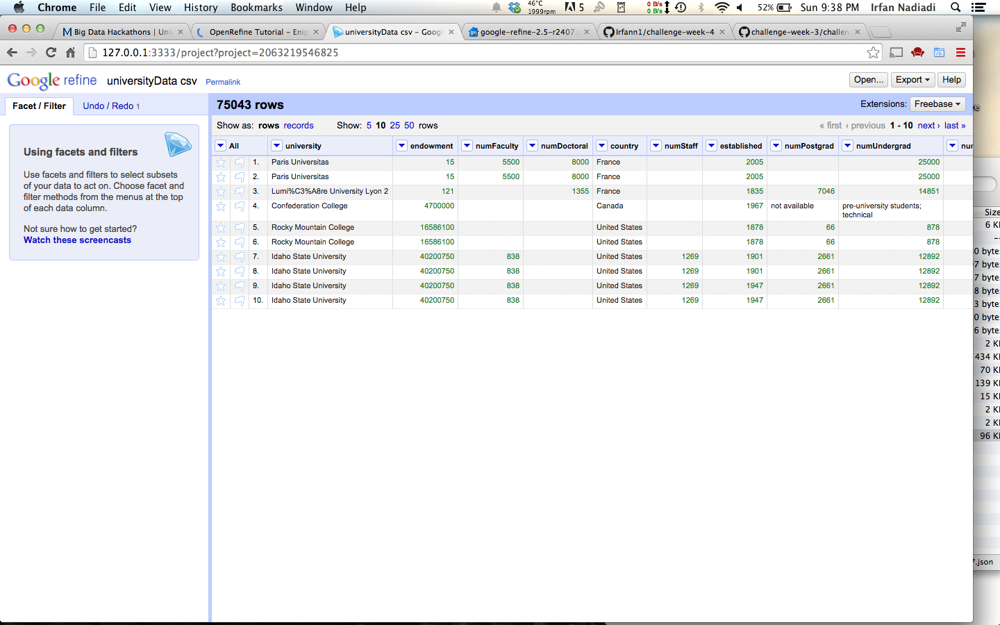

### 2 (4 points)

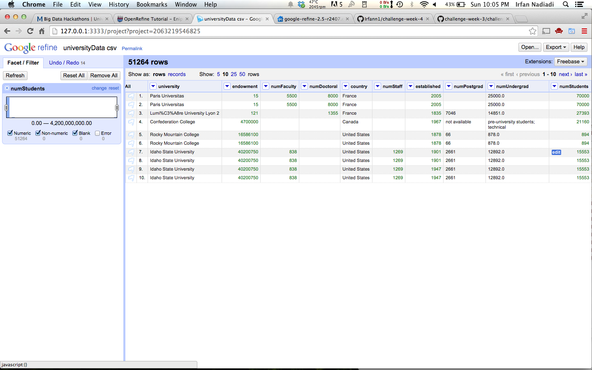

### 3 (4 points)

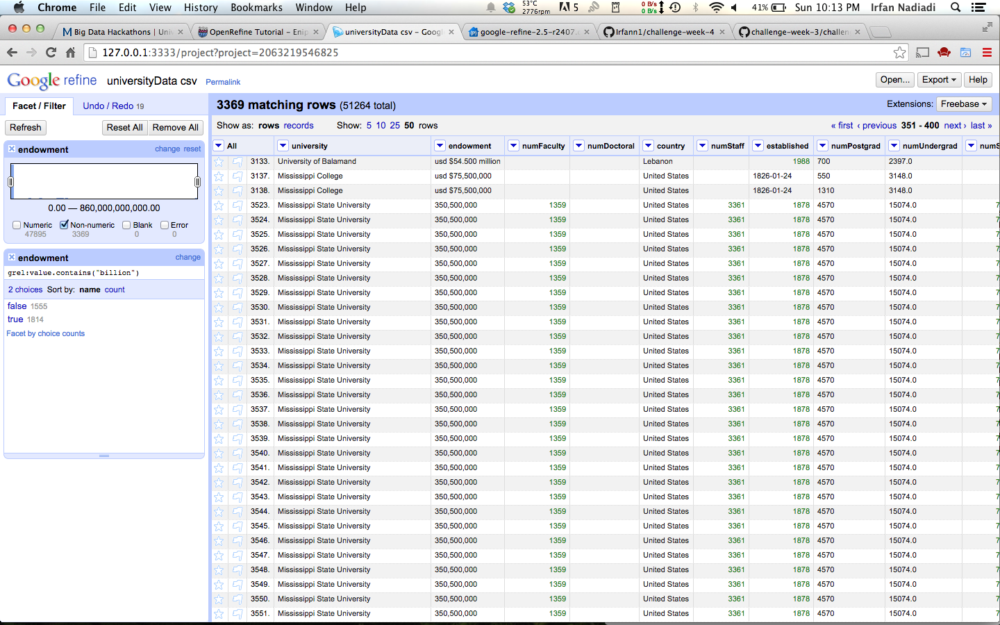

### 4 (4 points)

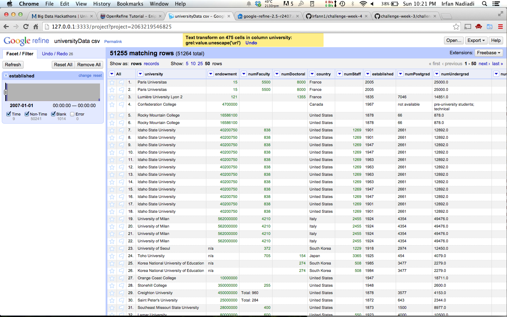

### 5 (4 points)

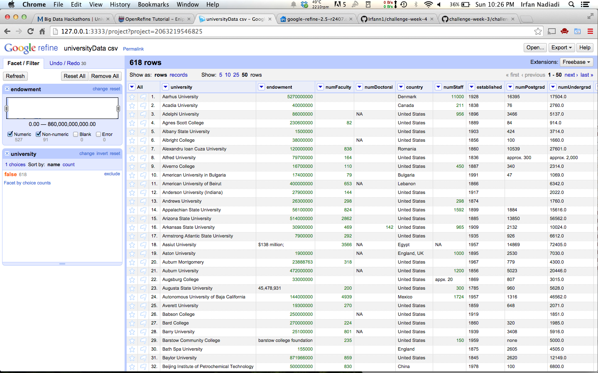

## Challenges (4 points x 7 + 10 points x 1 = 38 points)

### 1 (4 points)

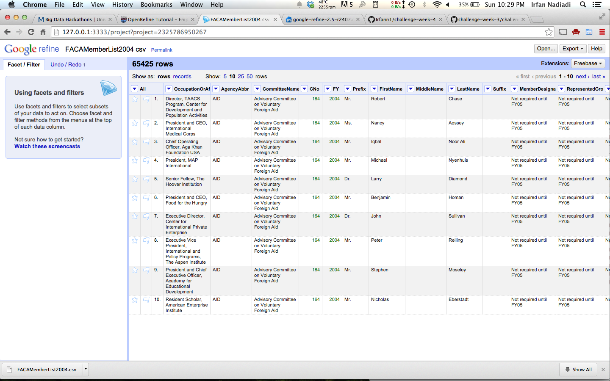

### 2 (4 points)

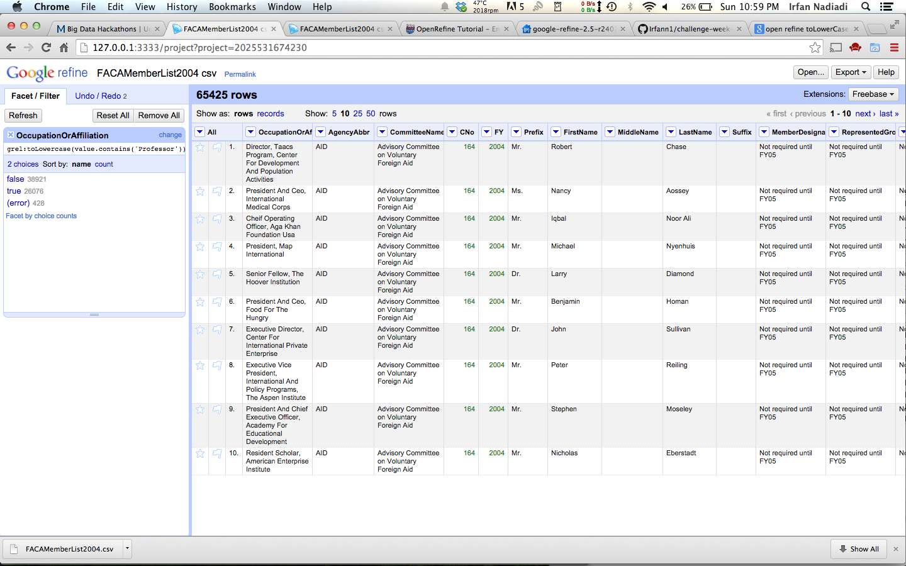

### 3 (4 points)

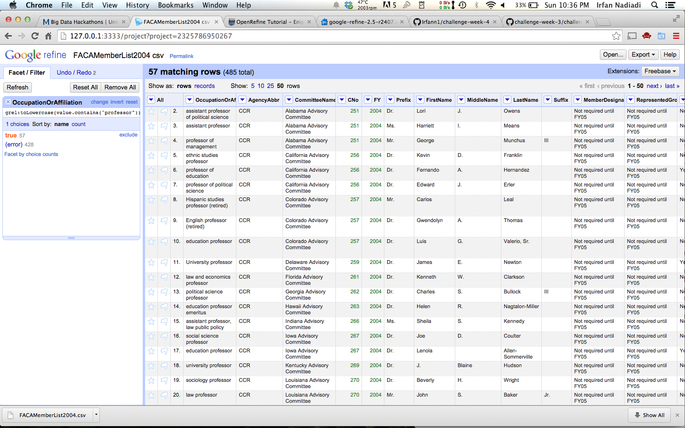

### 4 (4 points)

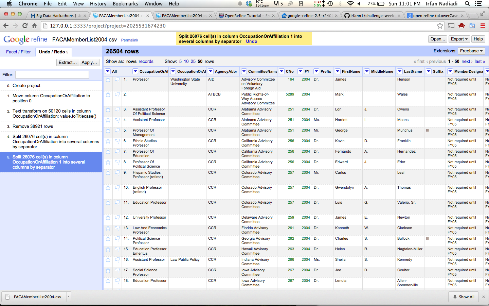

### 5 (4 points)

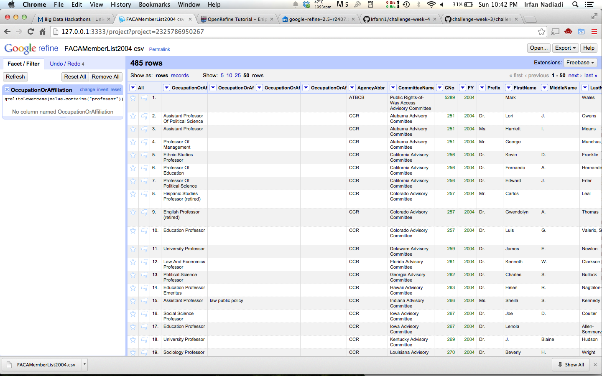

### 6 (4 points)

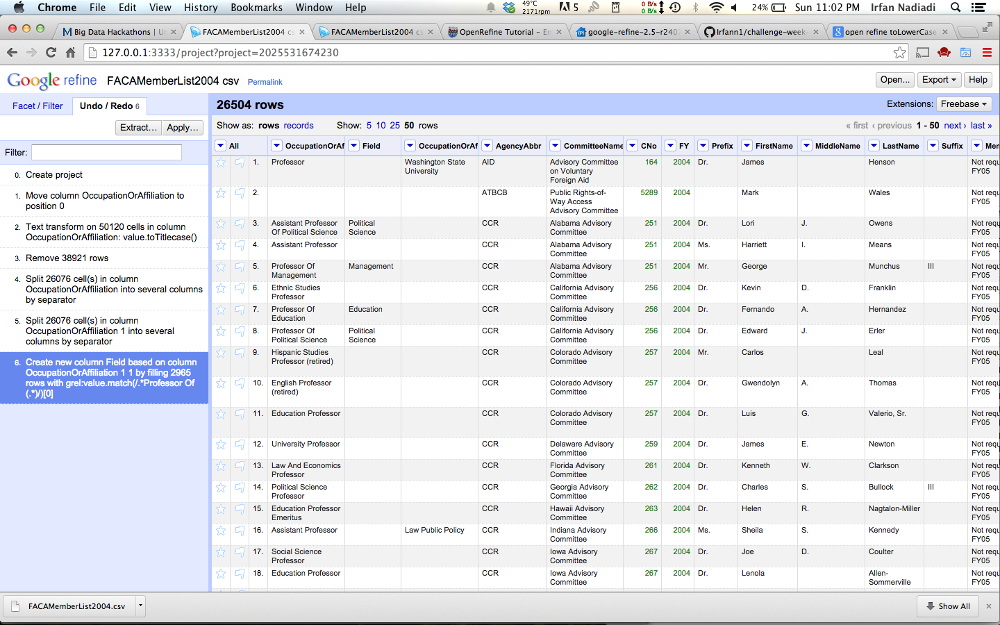

### 7 (4 points)

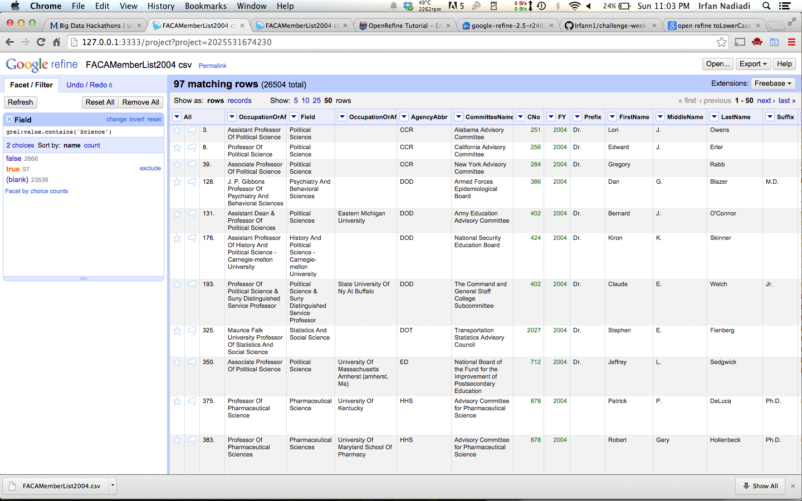

### 8 (10 points)

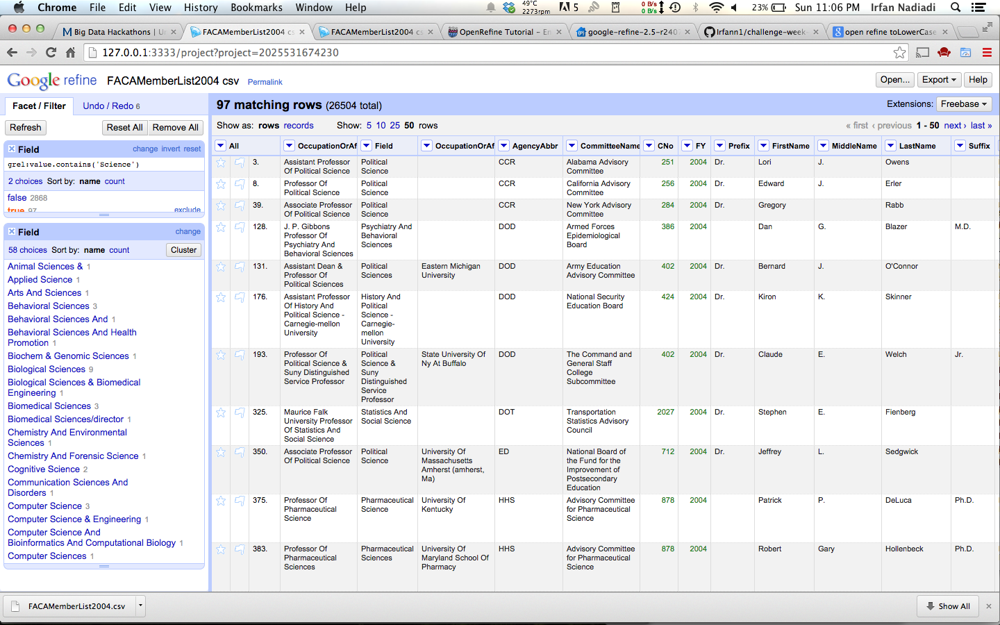
